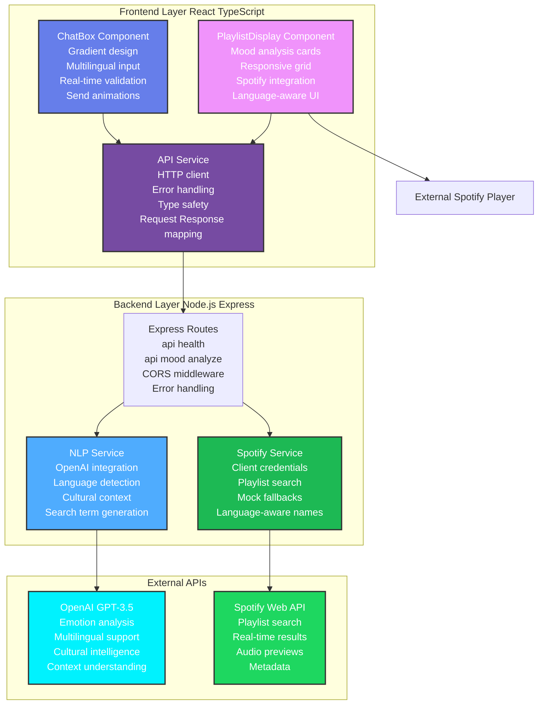
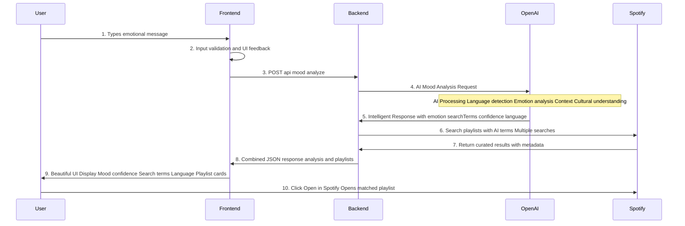
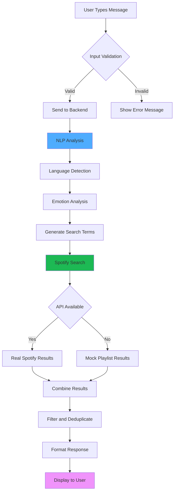
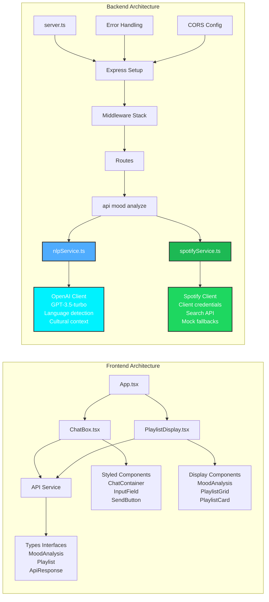
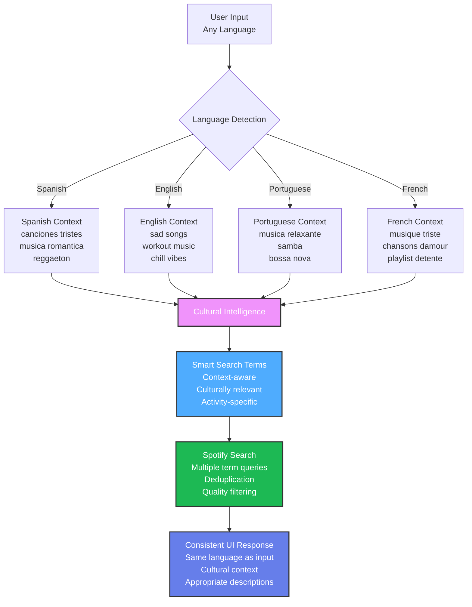

# 🎵 Moodify - Aplicación de Recomendación Musical con IA

> Transforma tus emociones en la playlist perfecta. Moodify analiza tu estado de ánimo a través de lenguaje natural y encuentra las listas de reproducción ideales de Spotify para cualquier sentimiento, en cualquier idioma.

## 🌟 Características

- **🤖 Análisis de Estado de Ánimo con IA** - OpenAI GPT-3.5 analiza tu estado emocional
- **🌍 Soporte Multiidioma** - Compatible con español, inglés, portugués y más
- **🎯 Contexto Cultural Inteligente** - Entiende preferencias musicales culturales y estilos regionales
- **🎨 Interfaz Moderna y Hermosa** - Diseño limpio y responsivo con gradientes
- **⚡ Integración en Tiempo Real con Spotify** - Busca playlists reales de Spotify o proporciona alternativas inteligentes
- **🔄 Coincidencia Inteligente de Idiomas** - Las respuestas siempre coinciden con el idioma de entrada

## 🏗️ Resumen de Arquitectura



## 🔄 Flujo Completo del Viaje del Usuario



## 🚀 Inicio Rápido

### Prerrequisitos

- Node.js 18+
- npm o yarn
- Clave API de OpenAI
- Cuenta de Desarrollador de Spotify (opcional - tiene respaldo)

### 1. Clonar el Repositorio

```bash
git clone <repository-url>
cd moodify
```

### 2. Configurar Backend

```bash
cd backend
npm install

# Crear archivo .env
echo "OPENAI_API_KEY=tu_clave_openai_aqui" > .env
echo "SPOTIFY_CLIENT_ID=tu_spotify_client_id" >> .env
echo "SPOTIFY_CLIENT_SECRET=tu_spotify_client_secret" >> .env
echo "PORT=3001" >> .env

# Iniciar backend
npm run dev
```

### 3. Configurar Frontend

```bash
cd ../frontend
npm install

# Crear archivo .env
echo "REACT_APP_API_URL=http://localhost:3001/api" > .env

# Iniciar frontend
npm start
```

### 4. Abrir el Navegador

Navega a `http://localhost:3000` ¡y comienza a expresar tus sentimientos!

## 🎯 Cómo Usar

### Uso Básico

1. **Expresa tu Estado de Ánimo**: Escribe cómo te sientes en cualquier idioma
   - 🇪🇸 "Estoy muy feliz hoy"
   - 🇺🇸 "I need to focus and study"
   - 🇧🇷 "Quero relaxar depois do trabalho"

2. **Obtén Análisis de IA**: Ve tu emoción y términos de búsqueda inteligentes

3. **Explora Playlists**: Navega listas curadas que coinciden con tu estado de ánimo

4. **Escucha en Spotify**: Haz clic en cualquier playlist para abrir en Spotify

### Ejemplos Avanzados

```bash
# Motivación para ejercicio
"Voy al gimnasio y necesito música con mucha energía"
→ ["música de gimnasio", "motivación workout", "alta energía", "fitness"]

# Sesión de estudio
"Necesito concentrarme para estudiar"
→ ["música para estudiar", "concentración", "lo-fi", "instrumental"]

# Contexto cultural
"Quiero música argentina para una fiesta"
→ ["música argentina", "tango", "folklore argentino", "cumbia argentina"]

# Apoyo emocional
"Me siento triste hoy"
→ ["música triste", "canciones melancólicas", "playlist emocional", "baladas"]
```

## 🔄 Diagrama de Flujo de Datos



## 🏗️ Arquitectura Técnica Detallada



## 🌍 Flujo de Inteligencia Multiidioma



## 📋 Ejemplos de Uso por Idioma

### Ejemplos en Español
```bash
Input: "Estoy muy feliz hoy"
Output: ["música alegre", "canciones felices", "pop positivo", "ritmos alegres"]

Input: "Necesito concentrarme para estudiar"
Output: ["música para estudiar", "concentración", "lo-fi", "instrumental"]

Input: "Me siento nostálgico"
Output: ["música nostálgica", "canciones del recuerdo", "clásicos", "baladas románticas"]
```

### Ejemplos en Inglés
```bash
Input: "I need workout motivation"
Output: ["workout music", "gym hits", "high energy", "fitness motivation"]

Input: "Feeling sad after breakup"
Output: ["breakup songs", "sad music", "heartbreak playlist", "emotional healing"]

Input: "Want to relax after work"
Output: ["chill music", "relaxing songs", "after work vibes", "calm playlist"]
```

### Ejemplos en Portugués
```bash
Input: "Quero música brasileira para festa"
Output: ["música brasileira", "festa brasileira", "samba", "pagode"]

Input: "Preciso relaxar"
Output: ["música relaxante", "bossa nova", "chill brasileiro", "sons da natureza"]
```

## 🌍 Soporte de Idiomas

Moodify detecta inteligentemente y responde en tu idioma:

| Idioma | Ejemplo de Entrada | Idioma de Salida |
|--------|-------------------|------------------|
| 🇪🇸 Español | "Estoy feliz" | Términos en español |
| 🇺🇸 Inglés | "I'm happy" | Términos en inglés |
| 🇧🇷 Portugués | "Estou feliz" | Términos en portugués |
| 🇫🇷 Francés | "Je suis heureux" | Términos en francés |

## 🔧 Configuración

### Variables de Entorno

#### Backend (.env)
```env
OPENAI_API_KEY=sk-tu-clave-openai
SPOTIFY_CLIENT_ID=tu-spotify-client-id
SPOTIFY_CLIENT_SECRET=tu-spotify-client-secret
PORT=3001
```

#### Frontend (.env)
```env
REACT_APP_API_URL=http://localhost:3001/api
```

### Endpoints de la API

```http
GET  /api/health              # Verificación de salud
POST /api/mood/analyze        # Análisis de estado de ánimo + búsqueda de playlists
```

## 🎨 Componentes de la Interfaz

### Características del ChatBox
- Diseño moderno con gradientes
- Texto de placeholder multiidioma
- Validación de entrada en tiempo real
- Animaciones suaves del botón de envío

### Características del PlaylistDisplay
- Tarjetas de análisis de estado de ánimo con puntuaciones de confianza
- Cuadrícula responsiva de playlists
- Botones de integración con Spotify
- Descripciones apropiadas para el idioma

## 🚀 Desarrollo

### Estructura del Proyecto

```
moodify/
├── backend/
│   ├── src/
│   │   ├── services/
│   │   │   ├── nlpService.ts      # Integración con OpenAI
│   │   │   └── spotifyService.ts  # API de Spotify
│   │   ├── routes/
│   │   │   ├── index.ts           # Configuración de rutas
│   │   │   └── mood.ts            # Endpoint de análisis de estado de ánimo
│   │   ├── middleware/            # Manejo de errores
│   │   └── server.ts              # Servidor Express
│   ├── package.json
│   └── tsconfig.json
├── frontend/
│   ├── src/
│   │   ├── components/
│   │   │   ├── ChatBox.tsx        # Entrada del usuario
│   │   │   └── PlaylistDisplay.tsx # Visualización de resultados
│   │   ├── services/
│   │   │   └── api.ts             # Comunicación con backend
│   │   └── App.tsx
│   ├── package.json
│   └── public/
└── README.md
```

### Comandos de Desarrollo

```bash
# Desarrollo del backend
cd backend
npm run dev          # Iniciar con recarga automática
npm run build        # Compilar TypeScript
npm start           # Iniciar servidor de producción

# Desarrollo del frontend  
cd frontend
npm start           # Iniciar servidor de desarrollo
npm run build       # Compilar para producción
npm test           # Ejecutar pruebas
```

## 🤝 Contribuir

1. Haz un fork del repositorio
2. Crea una rama para tu funcionalidad: `git checkout -b feature/funcionalidad-increible`
3. Confirma tus cambios: `git commit -m 'Agregar funcionalidad increíble'`
4. Empuja a la rama: `git push origin feature/funcionalidad-increible`
5. Abre un Pull Request

## 📝 Licencia

Este proyecto está licenciado bajo la Licencia MIT - consulta el archivo [LICENSE](LICENSE) para más detalles.

## 🙏 Reconocimientos

- **OpenAI** por la API GPT-3.5-turbo
- **Spotify** por la API Web
- **React** por el framework frontend
- **Express.js** por el servidor backend

---

**Construido con ❤️ usando curación musical impulsada por IA** 